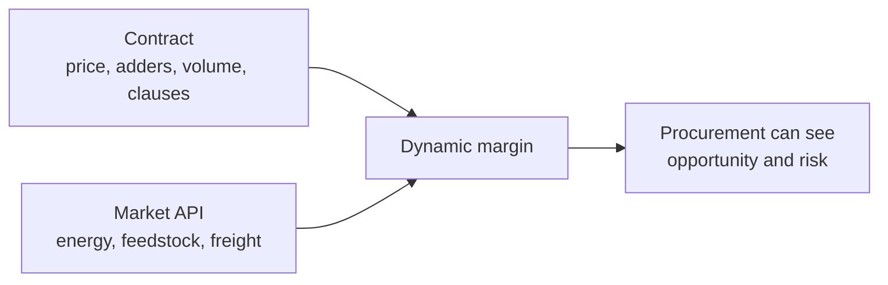
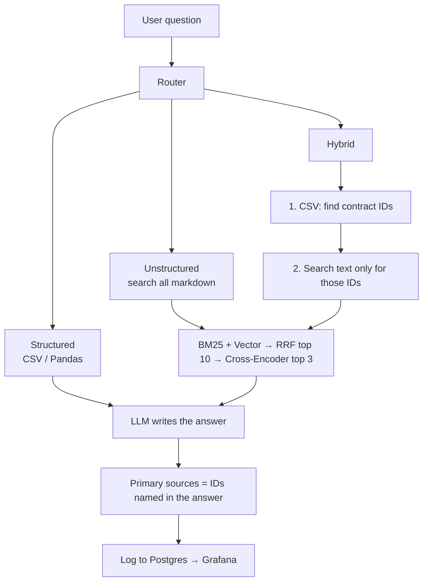

# Chemical Contracts Margin Checker

This project is the **foundation** for a bigger idea:

> **Contract + Market API = Dynamic Margin**

Today the app **reads the contract**. Later it can add daily market prices (oil, energy, freight, feedstock) and show whether a deal still makes money.

```text
TODAY (this repo)                    LATER
-----------------                    -----
Understand the contract              Same contracts
CSV numbers + clause text            + market API (spot / indices)
Answer questions                     Updated margin and risk
                                     Grafana on exposure
```



This README is about **today**: a small RAG app on **100 synthetic** chemical contracts.

---

## What you can ask today

Three kinds of questions. A **router** (small LLM call) picks the path.

| Example | Path | What happens |
|---|---|---|
| Which contract has the lowest price? | **Structured** | CSV / Pandas only. Ranking. |
| Which contracts have an energy adder above 5%? | **Structured** | CSV filter. |
| What is the total penalty exposure? | **Structured** | CSV sum. |
| What happens if the supplier fails to deliver? | **Unstructured** | Search **all** contract texts. |
| Lowest price **and** its payment terms? | **Hybrid** | CSV finds the cheap deal, then search **only that** markdown. |

**Two different “hybrid” words:**

- **Hybrid route** = CSV + text (the live app).
- **Hybrid search** = BM25 + vector + RRF (a retrieval recipe). The hybrid *route* uses hybrid *search* on a **short ID list**, not on the whole catalog.

---

## How a question flows



### Hybrid example (this is what Streamlit does)

Question: *Which contract has the lowest price and what are its payment terms?*

```text
Step 1  CSV
        cheapest base_price → CON-2023-0007  (Silica Sand, 250 EUR)

Step 2  Text search ONLY in CON-2023-0007 chunks
        payment terms, adders, penalties of that deal

Step 3  LLM answer
        Primary source: CON-2023-0007
        Secondary: other clauses from 0007, not random other agreements
```

If the question is an **average over all contracts** and names no product, step 2 is **skipped**. The app does not pull payment terms from 99 unrelated files.

Unstructured questions **do** search the whole catalog. There is no CSV step, so there is nothing to restrict to.

---

## Data

- **100** synthetic contracts (`CON-2023-0001` … `0100`)
- **784** text chunks with embeddings
- **6** clause layouts (Texas master, German Rahmenvertrag, English supply, SIAC, call-off PO, REACH)

`0001`–`0050` keep the same CSV numbers as the evaluation set. `0051`–`0100` add new products, customers, and currencies (USD / EUR / GBP / CHF).

Fields include product, base price, energy and raw-material adders, volumes, payment days, transport, shelf life, demurrage, penalties, and narrative clauses.

These are **not** real legal documents.

---

## Run it

```bash
cp .env.example .env
# put your OpenAI key in .env
# keep RAG_LLM_JUDGE=1, TZ=Europe/Berlin, DISPLAY_TZ=Europe/Berlin

docker compose up --build
```

| What | URL |
|---|---|
| App (Docker) | http://localhost:8502 |
| App (local `streamlit run app.py`) | http://localhost:8501 |
| Grafana | http://localhost:3000 (`admin` / `admin`) |

First start downloads embedding models and can take a few minutes. If Postgres still has the old 50 contracts, ingest runs again until it sees **100** distinct IDs.

Local ingest (if you run Streamlit without rebuilding Compose):

```bash
python -m src.margin_checker.ingest
```

You want **784** rows in `contract_chunks`, not 300.

Do **not** run `generate/generate_contracts.py` unless you intend to rebuild the files. Do **not** regenerate eval questions unless you also re-check hybrid adder math.

---

## Check the demo

1. Structured: `Which contract has the lowest price?`
2. Unstructured: `What happens if the supplier fails to deliver the agreed quantity?`
3. Hybrid: `Which contract has the lowest price and what are its payment terms?`  
   Secondary sources should be **that** contract, not random others.
4. Hybrid aggregate: `What is the average base price and typical payment terms?`  
   CSV average; **no** full-catalog clause dump.
5. History: last 10, Delete, Berlin time, thumbs, judge label.
6. Grafana Query Monitoring after one question.

The first question after a restart is slow. That is the Cross-Encoder loading.

---

## Evaluation

We test **three stages**, not one score.

```text
1. Did we pick the right route?     evaluate_route.py
2. Did text search find the IDs?    evaluate_retrieval.py
3. Is the answer good?              evaluate_answer.py
```

Commands (no comments on the same line — zsh will break):

```bash
python evaluation/evaluate_route.py
python evaluation/evaluate_retrieval.py
python evaluation/evaluate_answer.py
```

`--live` on answer eval runs the real RAG for every question. It is slow and costs extra OpenAI calls. Skip it if you already checked Streamlit.

A Hugging Face warning about `HF_TOKEN` is harmless for this demo.

### 1. Route — 90.0%

**45 / 50** questions got the same label as the dataset (structured / unstructured / hybrid).

The router is an LLM. 90% vs an older 94% on the same 50 questions is normal variation, not a broken app.

### 2. Retrieval

Hit@3 = at least one gold contract ID in the top 3.  
Full Hit@3 = **every** gold ID (needed when a question compares two contracts).  
MRR@3 = how high the first gold ID sits.

#### A) Full catalog (all 100 contracts)

“If we only had text search, would the gold ID appear in the top 3?”

This is the right test for **unstructured**. It is **harder than live hybrid**, because Streamlit hybrid does CSV first.

| Method | Hit@3 | Full Hit@3 | MRR@3 |
|---|---:|---:|---:|
| Vector | 54.0% | 40.0% | 0.5033 |
| BM25 | 56.0% | 46.0% | 0.5100 |
| Hybrid search (RRF@3) | **62.0%** | **48.0%** | **0.5633** |
| Rerank (RRF@10 + Cross-Encoder@3) | 38.0% | 36.0% | 0.3400 |

With 100 files this is noisier than the old 50-file table. **RRF is the best full-catalog method.** The Cross-Encoder (web-search model) **hurts** full-catalog ranking.

By question type (same full catalog):

| Subset | Best full-catalog method | Hit@3 | Full Hit@3 |
|---|---|---:|---:|
| Unstructured (14) | RRF | 35.7% | 35.7% |
| Hybrid questions (16) | BM25 or RRF | 50.0% | 6.2% (RRF) / 18.8% (BM25) |

Hybrid **Full Hit@3** is low because those questions have **two** gold IDs. Finding one cheap contract is not enough; the second ID is often missing from a top-3 over 100 files.

#### B) Gold-ID text search (live hybrid text step)

Chunks are taken **only** from `valid_contract_ids` in the eval file. That is Streamlit hybrid **after** CSV already found the deals.

| | Hit@3 | Full Hit@3 | MRR@3 |
|---|---:|---:|---:|
| All 50 questions | 100.0% | 96.0% | 1.0000 |
| Unstructured (14) | 100.0% | 100.0% | 1.0000 |
| Hybrid questions (16) | 100.0% | 87.5% | 1.0000 |

**Hit@3 = 100% is expected**, not a miracle. If you only search contract 0007, every chunk is 0007, so the gold ID cannot be missed. This row **proves the restrict works**: once step 1 has the IDs, text search stays inside that deal.

The useful leftover is **Full Hit@3 = 87.5%** on hybrid questions: two IDs, top 3 chunks sometimes all come from one of the two contracts. Ranking inside a tiny ID set is the remaining text issue, not “searching the whole catalog.”

```text
A) Full catalog                         B) Gold IDs only (live hybrid text)
Search 784 chunks                       Search ~8–16 chunks of the CSV hits
RRF Hit@3 62% overall                   Hit@3 100% (IDs are the filter)
Unstructured RRF 36%                    Hybrid Full Hit@3 87.5%
Cross-Encoder 38%  (worse)              = Streamlit hybrid after CSV
```

Unstructured in the UI still uses full-catalog RRF + Cross-Encoder (no CSV step). If that path looks weak, next lever is chunking or skipping the Cross-Encoder **for unstructured**, not restricting unstructured to CSV.

### 3. Answers — stored dataset

`python evaluation/evaluate_answer.py` judges answers **already stored** in `evaluation_dataset.json`. It does **not** call the live app.

| Route | Result |
|---|---|
| Structured | 20 / 20 correct |
| Unstructured | 14 / 14 relevant |
| Hybrid | 16 / 16 relevant |

That means the **eval file** is consistent. It is not a live RAG score. Streamlit (or `--live`) tests the running pipeline.

Structured gold answers come from the CSV. Hybrid gold answers were LLM-extracted; adder totals were checked as  
`base_price * (1 + energy_adder/100 + raw_material_adder/100)`.

You do **not** need to regenerate questions. New questions would not break the app, but hybrid math would need another CSV check.

---

## Grafana

Compose loads a dashboard from the repo (`grafana/dashboards/query-monitoring.json`). Do not delete `grafana/provisioning` if you want clones to get the same boards.

Logged fields: question, answer, route, time, tokens, cost, judge label, feedback.

---

## LLM judge

After each answer the app can ask the model: “Is this relevant?” That second call is the judge (`RAG_LLM_JUDGE=1`). Extra time and cost. Set `0` to skip.

---

## Limits (honest)

- **Foundation only.** No market API, no live margin yet.
- **Eval set is 50 questions** on contracts `0001`–`0050`, not on `0051`–`0100`.
- **Full-catalog retrieval got harder** with 100 contracts (RRF Hit@3 62%; unstructured only 36%). Live **hybrid** still restricts text to CSV IDs (gold-ID Hit@3 100%, hybrid Full Hit@3 87.5%).
- **Cross-Encoder hurt** full-catalog Hit@3 (38%). Do not treat that as the hybrid-route score. Gold-ID Hit@3 of 100% only means the ID filter worked.
- **Router ~90%.** Some questions are labelled hybrid/unstructured in a fuzzy way.
- **Synthetic contracts.** Not legal advice.
- **Docker / Postgres** needed for vectors. No login.
- **First question is slow.** Judge adds a second OpenAI call.

### Market API later — constraints (not blockers)

- Map synthetic product names to real indices.
- Align units and currencies with adders in the CSV.
- Decide spot vs month-ahead vs contract date.
- Keep market numbers on the **Pandas** path, not as extra RAG chunks.
- Handle missing API, keys, and licence terms.
- Show “indicative margin”, not financial advice.

---

## Project files (short)

```text
app.py                    Streamlit UI
docker-compose.yml        Postgres, Grafana, app
data/chemical_contracts.csv
data/contracts/*.md       100 markdown files
evaluation/               50-question set + scripts
generate/                 builders (do not run unless you mean to)
grafana/                  provisioned dashboard
src/margin_checker/       router, retrieval, rerank, rag, db
```

---

## Later

```text
Contract  +  Market API  =  Dynamic Margin
                         +  supply-chain risk / opportunity
```

This repo stops at **contract understanding**, with monitoring, so that step can be added without rebuilding retrieval from scratch.
