# Chemical Contracts Margin Checker

The app reads **100 synthetic** chemical contracts and a daily market file. It answers questions about the contract text and about an **indicative ton price**.

```text
indicative_price_per_ton = base_price + energy_amount + raw_amount
```

That figure is indicative. It is not a profit margin and not financial advice.

## Picture of the whole system

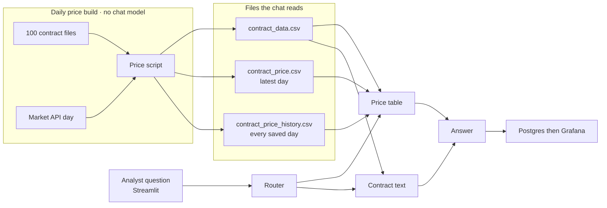
```mermaid
flowchart LR
  subgraph build [Daily price build · no chat model]
    MD[100 contract files]
    API[Market API day]
    CALC[Price script]
    MD --> CALC
    API --> CALC
  end
  subgraph files [Files the chat reads]
    CD[contract_data.csv]
    CP[contract_price.csv<br/>latest day]
    HI[contract_price_history.csv<br/>every saved day]
  end
  CALC --> CD
  CALC --> CP
  CALC --> HI
  AN[Analyst question<br/>Streamlit] --> RT[Router]
  RT --> ST[Price table]
  RT --> TX[Contract text]
  CP --> ST
  HI --> ST
  CD --> ST
  CD --> TX
  ST --> OUT[Answer]
  TX --> OUT
  OUT --> GR[Postgres then Grafana]
```

Two processes stay apart. The price build never calls a chat model. The question path is Streamlit.

---

## 1. Who builds the prices

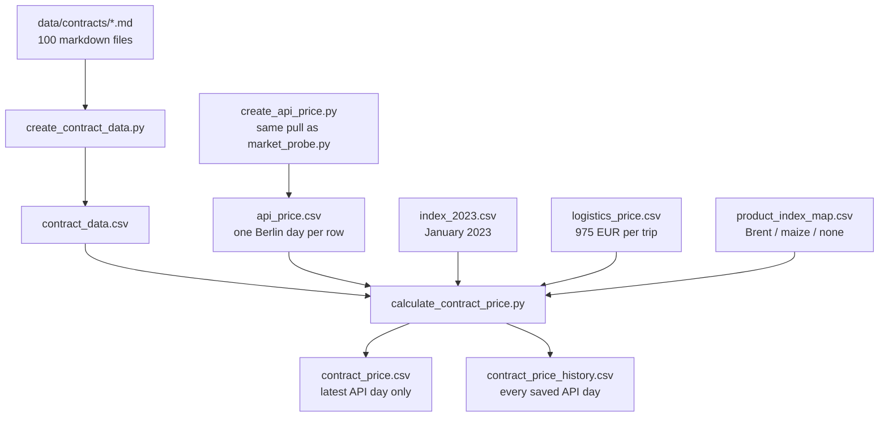
```mermaid
flowchart TD
  md["data/contracts/*.md<br/>100 markdown files"] --> ccd["create_contract_data.py"]
  ccd --> cdata["contract_data.csv"]
  pull["create_api_price.py<br/>same pull as market_probe.py"] --> api["api_price.csv<br/>one Berlin day per row"]
  cdata --> calc["calculate_contract_price.py"]
  api --> calc
  idx["index_2023.csv<br/>January 2023"] --> calc
  logi["logistics_price.csv<br/>975 EUR per trip"] --> calc
  pmap["product_index_map.csv<br/>Brent / maize / none"] --> calc
  calc --> latest["contract_price.csv<br/>latest API day only"]
  calc --> hist["contract_price_history.csv<br/>every saved API day"]
```

| Who | What they do |
|---|---|
| `create_contract_data.py` | Reads the 100 markdown contracts into `data/market/contract_data.csv`. |
| `create_api_price.py` | Pulls one Berlin day into `data/market/api_price.csv`. |
| `index_2023.csv` | January 2023 baselines: gas, Brent, maize, EURUSD, SOFR, Euribor. |
| `logistics_price.csv` | 975 EUR for one reference trip. |
| `product_index_map.csv` | Maps each product to Brent, maize, or none. |
| `calculate_contract_price.py` | Prices every API day and writes the two contract price files. |

`create_api_price.py` pulls seven series, with no API key:

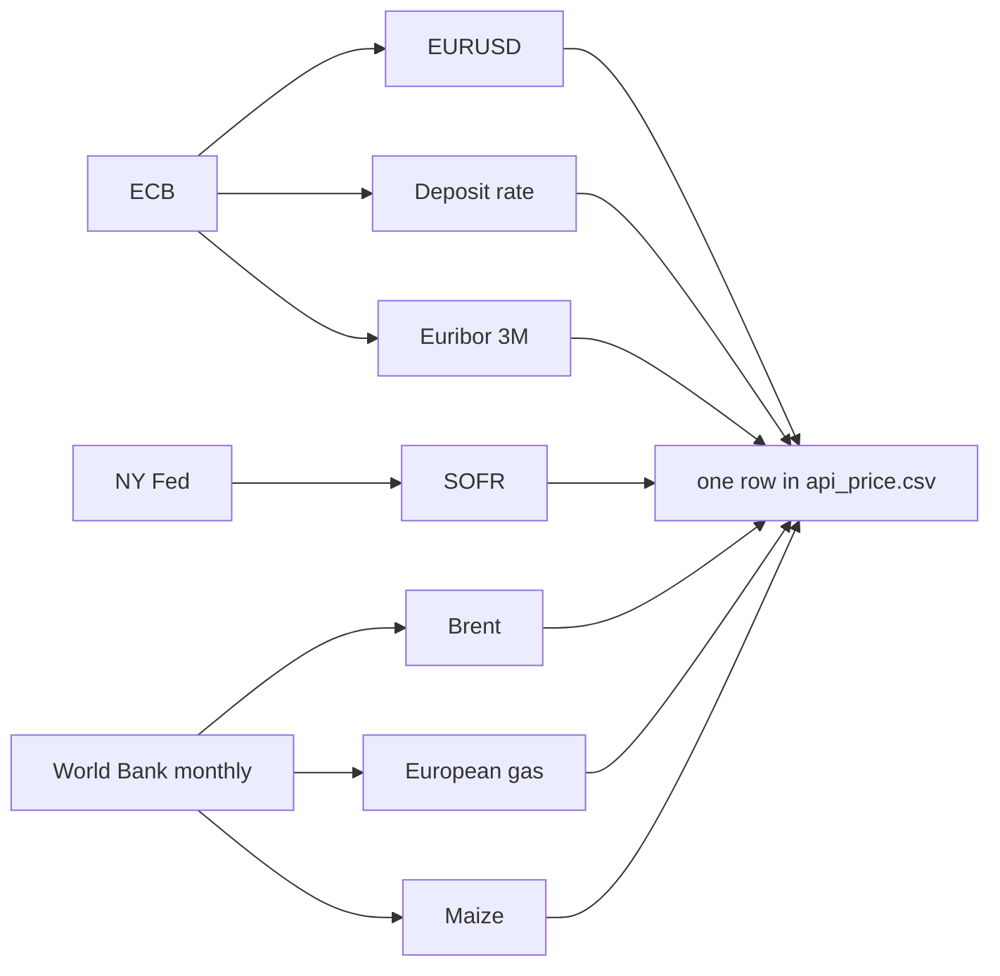
```mermaid
flowchart LR
  ECB[ECB] --> FX[EURUSD]
  ECB --> DEP[Deposit rate]
  ECB --> EUR[Euribor 3M]
  FED[NY Fed] --> SOFR[SOFR]
  WB[World Bank monthly] --> BR[Brent]
  WB --> GAS[European gas]
  WB --> MZ[Maize]
  FX --> ROW[one row in api_price.csv]
  DEP --> ROW
  EUR --> ROW
  SOFR --> ROW
  BR --> ROW
  GAS --> ROW
  MZ --> ROW
```

A second run on the same Berlin day replaces that row. A failed source keeps the last stored value. If there is no earlier value, the CSV stays unchanged.

Refresh the files with:

```bash
python data/scripts/create_api_price.py
python data/scripts/calculate_contract_price.py
```

Run the price script after the API script. The chat reads `contract_price.csv` and `contract_price_history.csv`.

### How one ton price is built

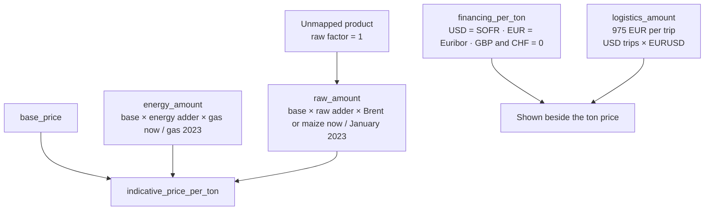
```mermaid
flowchart TD
  base[base_price] --> ton[indicative_price_per_ton]
  gas["energy_amount<br/>base × energy adder × gas now / gas 2023"] --> ton
  raw["raw_amount<br/>base × raw adder × Brent or maize now / January 2023"] --> ton
  none["Unmapped product<br/>raw factor = 1"] --> raw
  fin["financing_per_ton<br/>USD = SOFR · EUR = Euribor · GBP and CHF = 0"] --> side[Shown beside the ton price]
  ship["logistics_amount<br/>975 EUR per trip<br/>USD trips × EURUSD"] --> side
```

| Column | Rule |
|---|---|
| `energy_amount` | `base_price` × energy adder × (gas now / gas January 2023) |
| `raw_amount` | `base_price` × raw adder × (Brent or maize now / January 2023). Unmapped products use factor 1. |
| `indicative_price_per_ton` | `base_price` + `energy_amount` + `raw_amount` |
| `financing_per_ton` | SOFR for USD, Euribor for EUR, 0 for GBP and CHF. Column only. |
| `logistics_amount` | 975 EUR per trip. USD trips are multiplied by EURUSD. EUR, GBP, and CHF stay 975 EUR. Column only. |

Financing and logistics are written beside the ton price. They are left out of `indicative_price_per_ton`. They appear in the answer when the question asks about financing or logistics.

### Latest file and history file

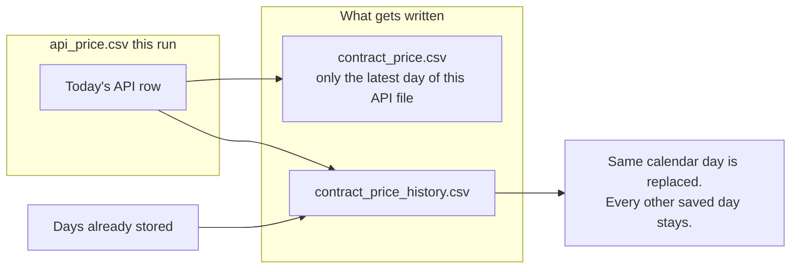
```mermaid
flowchart LR
  subgraph apiFile [api_price.csv this run]
    today[Today's API row]
  end
  subgraph out [What gets written]
    latest[contract_price.csv<br/>only the latest day of this API file]
    hist[contract_price_history.csv]
  end
  today --> latest
  old[Days already stored] --> hist
  today --> hist
  hist --> rule["Same calendar day is replaced.<br/>Every other saved day stays."]
```

`contract_price.csv` is the latest day of the current API file only.

`contract_price_history.csv` is every saved API day. A day present in this run replaces that day only. Older days stay. The CSV file is rewritten. The older days remain in the content.

---

## 2. Who answers one question

The analyst types the question in `app.py`. One question runs one calculation.

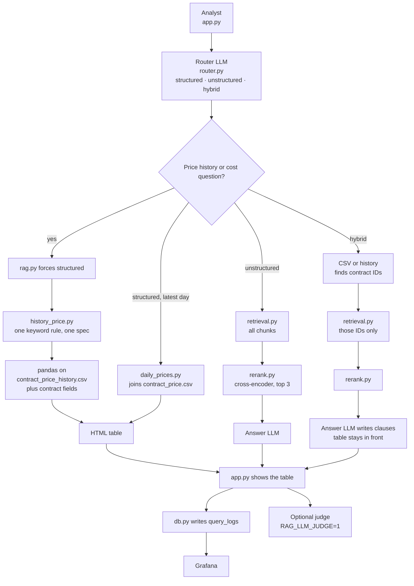
```mermaid
flowchart TD
  analyst["Analyst<br/>app.py"] --> router["Router LLM<br/>router.py<br/>structured · unstructured · hybrid"]
  router --> gate{"Price history or cost question?"}
  gate -->|yes| force["rag.py forces structured"]
  force --> rules["history_price.py<br/>one keyword rule, one spec"]
  rules --> hist["pandas on<br/>contract_price_history.csv<br/>plus contract fields"]
  hist --> table["HTML table"]
  gate -->|structured, latest day| join["daily_prices.py<br/>joins contract_price.csv"]
  join --> table
  table --> show["app.py shows the table"]
  gate -->|unstructured| search["retrieval.py<br/>all chunks"]
  search --> rerank["rerank.py<br/>cross-encoder, top 3"]
  rerank --> writer["Answer LLM"]
  gate -->|hybrid| ids["CSV or history<br/>finds contract IDs"]
  ids --> narrow["retrieval.py<br/>those IDs only"]
  narrow --> rerank2["rerank.py"]
  rerank2 --> both["Answer LLM writes clauses<br/>table stays in front"]
  writer --> show
  both --> show
  show --> pg["db.py writes query_logs"]
  pg --> graf["Grafana"]
  show --> judge["Optional judge<br/>RAG_LLM_JUDGE=1"]
```

| Who | What they do |
|---|---|
| Analyst in `app.py` | Types the question and reads the answer. |
| `router.py` | Small LLM. Chooses `structured`, `unstructured`, or `hybrid`. |
| `rag.py` | If the question is a price history or a cost comparison, forces `structured` even when the router picked text. |
| `history_price.py` | Builds one spec from keyword rules and renders the HTML table. |
| `daily_prices.py` | Joins the latest `contract_price.csv` row onto the contract fields. |
| `retrieval.py` | BM25 plus vector search, fused with RRF. |
| `rerank.py` | Cross-encoder on the RRF candidates. Keeps the top 3. |
| Answer LLM in `rag.py` | Writes from contract chunks on the text paths. |
| `db.py` | Inserts the question into Postgres `query_logs`. |
| Grafana | Reads that log. |
| Judge | Optional second LLM call when `RAG_LLM_JUDGE=1`. |

The router runs first. `rag.py` then overrides the route for a price-history or cost question.

### Which rule wins

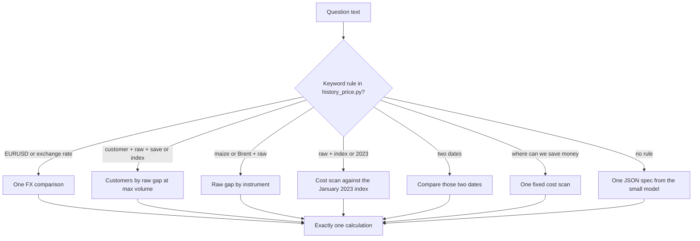
```mermaid
flowchart TD
  q[Question text] --> k{Keyword rule in history_price.py?}
  k -->|EURUSD or exchange rate| fx[One FX comparison]
  k -->|customer + raw + save or index| gap[Customers by raw gap at max volume]
  k -->|maize or Brent + raw| inst[Raw gap by instrument]
  k -->|raw + index or 2023| scan[Cost scan against the January 2023 index]
  k -->|two dates| cmp[Compare those two dates]
  k -->|where can we save money| open[One fixed cost scan]
  k -->|no rule| json[One JSON spec from the small model]
  fx --> one[Exactly one calculation]
  gap --> one
  inst --> one
  scan --> one
  cmp --> one
  open --> one
  json --> one
```

On the structured path, the interpreter may return one JSON spec. Keyword rules in `history_price.py` replace that spec when the wording matches. Open questions such as “where can we save money” and “today, cost saving” are that one fixed cost scan.

Numbers come only from the CSVs. The answer model leaves those numbers as rendered.

A sentence with three dates uses the first pair. A second pair needs a second question.

### How the table looks

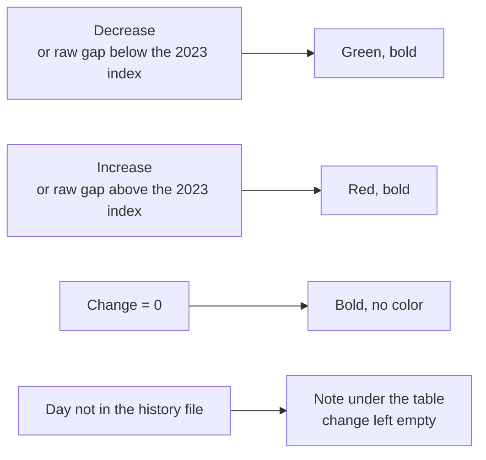
```mermaid
flowchart LR
  down["Decrease<br/>or raw gap below the 2023 index"] --> green["Green, bold"]
  up["Increase<br/>or raw gap above the 2023 index"] --> red["Red, bold"]
  zero["Change = 0"] --> plain["Bold, no color"]
  miss["Day not in the history file"] --> note["Note under the table<br/>change left empty"]
```

Streamlit shows the table with `st.markdown(..., unsafe_allow_html=True)`. Key figures are bold. A decrease, or a negative raw gap, is green. An increase, or a positive gap, is red. Zero is neutral. A missing day is a note and a null change.

A price movement is a change in the ton price.

### Three routes, side by side.


```mermaid
flowchart TB
  subgraph s [Structured]
    s1[Pandas on the price CSVs]
    s2[HTML table]
    s3[No contract-text search]
    s1 --> s2 --> s3
  end
  subgraph u [Unstructured]
    u1[Search all 784 chunks]
    u2[BM25 + vector]
    u3[RRF top 10]
    u4[Cross-encoder top 3]
    u5[LLM writes the clause answer]
    u1 --> u2 --> u3 --> u4 --> u5
  end
  subgraph h [Hybrid]
    h1[CSV or history finds IDs]
    h2[Search only those contracts]
    h3[Cross-encoder top 3]
    h4[LLM writes clauses]
    h5[Price table stays in front]
    h1 --> h2 --> h3 --> h4 --> h5
  end
```

**Structured.** Latest-day questions use pandas on `contract_data.csv` joined with `contract_price.csv`. History and cost questions use pandas on `contract_price_history.csv` joined with contract fields, including monthly volume. Structured-only answers do not call the retriever, so they have no rerank score. The UI says: “Cross-encoder rerank applies to contract-text search. This answer came from the price table.”

**Unstructured.** Search all contract chunks. BM25 and vector search, RRF top 10, then the cross-encoder top 3. The LLM writes the answer from those chunks. The source title shows the RRF score and the Reranker score.

**Hybrid.** The CSV or history step finds contract IDs. Text search runs only on those IDs, then the cross-encoder, then the LLM. If a structured table was rendered, those numbers are prepended. The LLM does not replace them. An average over all contracts that names no product skips the text step.

```text
Hybrid example
Question: Which contract has the lowest price and what are its payment terms?

Step 1  CSV
        cheapest base_price → CON-2023-0007  (Silica Sand, 250 EUR)

Step 2  Text search ONLY in CON-2023-0007 chunks
        payment terms, adders, penalties of that deal

Step 3  LLM writes the payment terms
        The HTML price table stays in front of that clause text
        Primary source: CON-2023-0007
        Secondary: other clauses from 0007
```

Two uses of the word hybrid:

- **Hybrid route** = CSV plus text in the live app.
- **Hybrid search** = BM25 plus vector plus RRF. The hybrid route uses that search on a short ID list.

### When the answer cannot be built

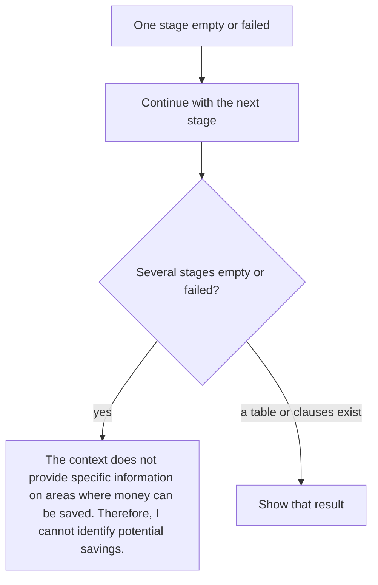
```mermaid
flowchart TD
  a[One stage empty or failed] --> cont[Continue with the next stage]
  cont --> many{Several stages empty or failed?}
  many -->|yes| std["The context does not provide specific information on areas where money can be saved. Therefore, I cannot identify potential savings."]
  many -->|a table or clauses exist| out[Show that result]
```

---

## What you can ask

| Example | Path | What happens |
|---|---|---|
| Which contract has the lowest price? | **Structured** | Pandas on the latest price table. Ranking. |
| Which contracts have an energy adder above 5%? | **Structured** | CSV filter. |
| What is the total penalty exposure? | **Structured** | CSV sum. |
| How did the Ethanol price change compared with the previous day? | **Structured** | `history_price.py` on `contract_price_history.csv`. HTML table. |
| Where can we save money? | **Structured** | One fixed cost scan. |
| What happens if the supplier fails to deliver? | **Unstructured** | Search all contract texts. RRF and Reranker scores on each source. |
| Lowest price and its payment terms? | **Hybrid** | CSV finds the cheap deal, then search only that markdown. |

---

## Data

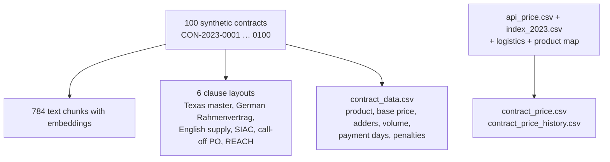
```mermaid
flowchart TB
  contracts["100 synthetic contracts<br/>CON-2023-0001 … 0100"] --> chunks["784 text chunks with embeddings"]
  contracts --> layouts["6 clause layouts<br/>Texas master, German Rahmenvertrag,<br/>English supply, SIAC, call-off PO, REACH"]
  contracts --> csv["contract_data.csv<br/>product, base price, adders, volume,<br/>payment days, penalties"]
  market["api_price.csv + index_2023.csv<br/>+ logistics + product map"] --> prices["contract_price.csv<br/>contract_price_history.csv"]
```

`0001`–`0050` keep the same CSV numbers as the evaluation set. `0051`–`0100` add new products, customers, and currencies (USD / EUR / GBP / CHF).

These are synthetic contracts. They are not legal documents.

---

## Run it

```bash
cp .env.example .env
pip install -r requirements.txt
# put your OpenAI key in .env
# keep RAG_LLM_JUDGE=1, TZ=Europe/Berlin, DISPLAY_TZ=Europe/Berlin

docker compose up --build
```

| What | URL |
|---|---|
| App (Docker) | http://localhost:8502 |
| App (local `streamlit run app.py`) | http://localhost:8501 |
| Grafana | http://localhost:3000 (`admin` / `admin`) |

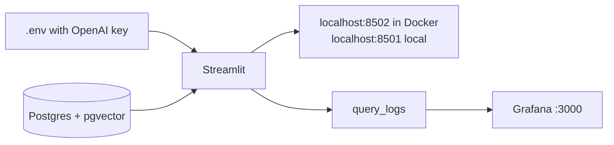
```mermaid
flowchart LR
  env[.env with OpenAI key] --> app[Streamlit]
  pg[(Postgres + pgvector)] --> app
  app --> ui["localhost:8502 in Docker<br/>localhost:8501 local"]
  app --> logs[query_logs]
  logs --> grafana["Grafana :3000"]
```

First start downloads embedding models and can take a few minutes. If Postgres still has the old 50 contracts, ingest runs again until it sees **100** distinct IDs.

```bash
python -m src.margin_checker.ingest
```

You want **784** rows in `contract_chunks`.

Leave `generate/generate_contracts.py` and the eval-question builders unused unless you intend to rebuild those files.

---

## Check the demo

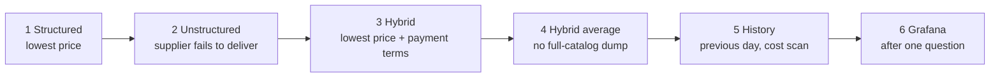
```mermaid
flowchart LR
  q1["1 Structured<br/>lowest price"] --> q2["2 Unstructured<br/>supplier fails to deliver"]
  q2 --> q3["3 Hybrid<br/>lowest price + payment terms"]
  q3 --> q4["4 Hybrid average<br/>no full-catalog dump"]
  q4 --> q5["5 History<br/>previous day, cost scan"]
  q5 --> q6["6 Grafana<br/>after one question"]
```

1. Structured: `Which contract has the lowest price?`
2. Unstructured: `What happens if the supplier fails to deliver the agreed quantity?`  
   Each source shows `RRF` and `Reranker`.
3. Hybrid: `Which contract has the lowest price and what are its payment terms?`  
   Secondary sources should be that contract.
4. Hybrid aggregate: `What is the average base price and typical payment terms?`  
   CSV average. The text step is skipped.
5. History: `How did the Ethanol ton price change compared with the previous day?`  
   Green, red, or a neutral zero. A missing day stays empty.
6. Cost scan: `Where can we save money?`  
   One table from the price history.
7. Grafana Query Monitoring after one question.

The first question after a restart is slow. That is the Cross-Encoder loading.

---

## Evaluation

Three stages, three scripts. The stored file is a consistency check. It is a live price-history score only when you run the app or pass `--live`.

```text
1. Did we pick the right route?     evaluate_route.py
2. Did text search find the IDs?    evaluate_retrieval.py
3. Is the answer good?              evaluate_answer.py
```

```bash
python evaluation/evaluate_route.py
python evaluation/evaluate_retrieval.py
python evaluation/evaluate_answer.py
```

### 1. Route — 90.0%

**45 / 50** questions got the same label as the dataset. The router is an LLM, so this share moves between runs.

### 2. Retrieval

Hit@3 = at least one gold contract ID in the top 3.  
Full Hit@3 = every gold ID.  
MRR@3 = how high the first gold ID sits.

#### A) Full catalog, all 100 contracts

| Method | Hit@3 | Full Hit@3 | MRR@3 |
|---|---:|---:|---:|
| Vector | 54.0% | 40.0% | 0.5033 |
| BM25 | 56.0% | 46.0% | 0.5100 |
| Hybrid search, RRF@3 | **62.0%** | **48.0%** | **0.5633** |
| Rerank, RRF@10 + Cross-Encoder@3 | 38.0% | 36.0% | 0.3400 |

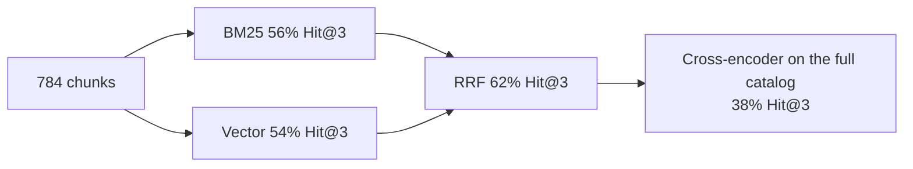
```mermaid
flowchart LR
  chunks[784 chunks] --> bm25[BM25 56% Hit@3]
  chunks --> vec[Vector 54% Hit@3]
  bm25 --> rrf[RRF 62% Hit@3]
  vec --> rrf
  rrf --> ce[Cross-encoder on the full catalog<br/>38% Hit@3]
```

On the full catalog, RRF is the strongest of these four. The cross-encoder lowers full-catalog Hit@3. Unstructured questions in the UI still use RRF and then the cross-encoder, because that path has no CSV ID list.

| Subset | Best full-catalog method | Hit@3 | Full Hit@3 |
|---|---|---:|---:|
| Unstructured (14) | RRF | 35.7% | 35.7% |
| Hybrid questions (16) | BM25 or RRF | 50.0% | 6.2% RRF / 18.8% BM25 |

Hybrid Full Hit@3 is low because those questions have two gold IDs. A top-3 over 100 files often contains only one of them.

#### B) Gold-ID text search, the live hybrid text step

Chunks are taken only from `valid_contract_ids`. That is Streamlit hybrid after the CSV step.

| | Hit@3 | Full Hit@3 | MRR@3 |
|---|---:|---:|---:|
| All 50 questions | 100.0% | 96.0% | 1.0000 |
| Unstructured (14) | 100.0% | 100.0% | 1.0000 |
| Hybrid questions (16) | 100.0% | 87.5% | 1.0000 |

Hit@3 of 100% means the ID filter held: every chunk belongs to the contracts the CSV already named. Hybrid Full Hit@3 of 87.5% means two gold IDs, while the top 3 chunks sometimes all come from one of them.

### 3. Answers in the stored dataset

`python evaluation/evaluate_answer.py` judges answers already stored in `evaluation_dataset.json`. It does not call the live app.

| Route | Result |
|---|---|
| Structured | 20 / 20 correct |
| Unstructured | 14 / 14 relevant |
| Hybrid | 16 / 16 relevant |

The stored 20/20 is the eval file. Live price-history tables are rendered from `contract_price_history.csv` in Streamlit. `--live` runs the real RAG and spends extra OpenAI calls.

Structured gold answers come from the CSV. Hybrid gold answers use  
`base_price * (1 + energy_adder/100 + raw_material_adder/100)`  
as the checked adder total. The live indicative ton price uses the API ratio on top of that adder, so a history answer and this gold formula are different numbers.

---

## Grafana and the judge

Compose loads `grafana/dashboards/query-monitoring.json`. Logged fields: question, answer, route, time, tokens, cost, judge label, feedback.

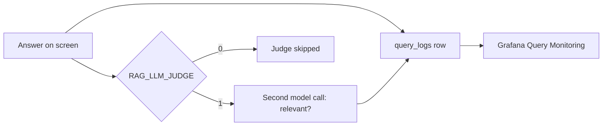
```mermaid
flowchart LR
  answer[Answer on screen] --> row[query_logs row]
  row --> board[Grafana Query Monitoring]
  answer --> judge{RAG_LLM_JUDGE}
  judge -->|1| second[Second model call: relevant?]
  judge -->|0| skip[Judge skipped]
  second --> row
```

The judge is a second model call. It adds time and cost. Set `RAG_LLM_JUDGE=0` to skip it.

---

## Limits

- The ton price is indicative. A price change is a price change.
- The eval set is 50 questions on contracts `0001`–`0050`.
- Full-catalog retrieval on 100 contracts: RRF Hit@3 62%, unstructured 35.7%, cross-encoder 38%.
- Live hybrid text search, after the CSV ID list: Hit@3 100%, hybrid Full Hit@3 87.5%.
- Router agreement with the dataset is about 90%.
- One question runs one calculation. Three dates in one sentence use the first pair.
- A missing history day stays empty.
- The contracts are synthetic.
- Docker and Postgres hold the vectors. There is no login.
- The first question is slow because the cross-encoder loads. The judge adds a second OpenAI call.

---

## Project files

```text
app.py                         Streamlit UI, table and sources
docker-compose.yml             Postgres, Grafana, app on :8502
data/contracts/*.md            100 markdown files
data/market/contract_data.csv
data/market/api_price.csv
data/market/contract_price.csv
data/market/contract_price_history.csv
data/market/index_2023.csv
data/market/logistics_price.csv
data/market/product_index_map.csv
data/scripts/create_contract_data.py
data/scripts/create_api_price.py
data/scripts/calculate_contract_price.py
src/margin_checker/router.py
src/margin_checker/rag.py
src/margin_checker/history_price.py
src/margin_checker/daily_prices.py
src/margin_checker/retrieval.py
src/margin_checker/rerank.py
src/margin_checker/db.py
evaluation/                    50-question set and the three scripts
grafana/                       provisioned dashboard
```
